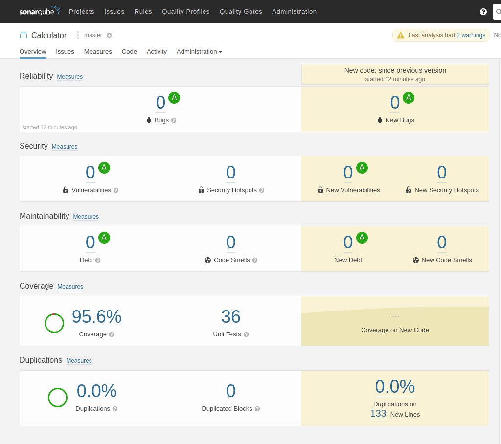

## Requirements

For building and running the application you need:

- [JDK 1.11](http://www.oracle.com/technetwork/java/javase/downloads/jdk8-downloads-2133151.html)
- [Docker](https://docs.docker.com/)
- [Docker-Compose](https://docs.docker.com/compose/)

## Running the application locally

There are many ways to run this application locally. One of those ways is to build the JAR with
```shell
./gradlew clean build
```
And then deploy the JAR to the container with docker-compose
```shell
docker-compose up
```
use -D flag with docker-compose to detach head. Another way of running the application would be to just bootRun the applicaiton
```shell
./gradlew bootRun
```
but the application is dependant on 2 container: calculator_memcached & calculator_postgres, therefore you need those up and running first: 
```
docker-compose up calculator_memcached -d
docker-compose up calculator_postgres -d
```
When bootRunning application.properties file needs to be changed accordingly(container service name changed to localhost): 
```
spring.datasource.url=jdbc:postgresql://localhost:5432/calculator
spring.datasource.username=postgres
spring.datasource.password=postgres
memcached.cache.servers=localhost:11211
memcached.cache.expirations=30
```

## Running the tests locally
```
./gradlew test
```
The report will be generated /build/reports/tests/test/index.html

The tests create a postgres and a memcache docker testContainer, so docker is also required for running the tests.

## SonarCube

Open the command line and run this Docker command to pull the official SonarQube image and start the container.
```
docker pull sonarqube

```

```
docker run -d --name sonarqube -p 9000:9000 -p 9092:9092 sonarqube
```


Now you can browse to http://localhost:9000 to view SonarQube’s Web interface. From here you can manage all your projects and review the results of the analysis. Go ahead and log in using admin/admin which is the default password.

Run the gradle sonarCube tasks and you can see the results.

```
./gradlew sonarqube
```

The application is verified with sonarQube

  